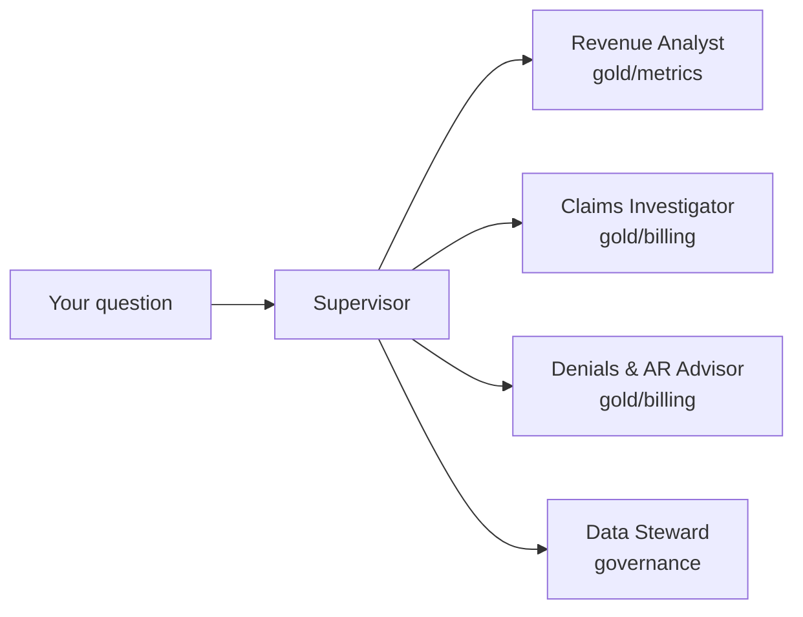

# Claimwise Agents

**Claimwise Revenue Copilot** — a multi-agent showcase built with
[Strands Agents](https://strandsagents.com), deployed on
[Amazon Bedrock AgentCore](https://aws.amazon.com/bedrock/agentcore/). One
agent per bounded context, over the
[Claimwise](https://github.com/senthilsweb/claimwise) dbt gold layer. The
[Revenue Pulse dashboard](https://github.com/senthilsweb/claimwise/tree/main/dashboards)
shows the numbers; this copilot explains them.



## I want to… → run this

```bash
git clone https://github.com/senthilsweb/claimwise-agents.git && cd claimwise-agents
cp .env.sample .env   # point DUCKDB_PATH at a built claimwise/dbt-pipeline/rcm.duckdb
```

| I want to… | Run this |
|---|---|
| Try it with zero AWS cost | `make setup && make smoke` — [Getting Started](docs/getting-started.md) |
| Chat with the full crew | `make run` — [Examples](docs/examples.md) |
| Talk to one specialist directly | `make run AGENT=investigator` (or `analyst` / `advisor` / `steward`) |
| Run the deterministic eval suite | `make eval` — 19 questions checked against live values |
| Serve it over HTTP like AgentCore Runtime would | `PORT=18080 make runtime-dev` — [Examples](docs/examples.md) |
| Chat with the **deployed** agent from a browser widget | `make chat`, then open <http://localhost:3000> — [chat-adapter/](chat-adapter/README.md) |
| See every prompt and tool call | Set up tracing — [Operations](docs/operations.md) |
| Understand the agent design | [Architecture](docs/architecture.md) |

## Documentation

The wiki lives in [docs/](docs/) and is published at
<https://senthilsweb.github.io/claimwise-agents/> — following the
`ai-agent-docs` skill's standard:

- [Overview](docs/index.md) — what it is, why it exists, the bounded context
- [Getting Started](docs/getting-started.md) — two 5-minute paths in
- [Code Tour](docs/code-tour.md) — the folder tree and the five load-bearing files
- [Architecture](docs/architecture.md) — tech stack, bounded-context design, agent flow, harness engineering, security
- [Chat Channel](docs/chat-channel.md) — how a chat client reaches the deployed agent through chat-adapter, and what a new channel (Slack, Teams) would add
- [Configuration](docs/configuration.md) — every environment variable
- [Examples](docs/examples.md) — every way to call the agents, with real output
- [Deployment & Integration](docs/deployment-integration.md) — running it locally and **live on AWS**
- [Operations](docs/operations.md) — tracing, cost, and every real failure with its fix
- [Reference](docs/reference.md) — the API schema, error codes, FAQ

## Layout

```
openspec/           specs and change proposals — the intent lives here
agents/              the Python package
  contexts/           one file per bounded-context agent, plus the Supervisor
  tools/              the tools each agent is allowed to call
  eval/               tool_smoke (no LLM) + golden/claim/routing evals
  runtime.py          the AgentCore Runtime HTTP entrypoint
  cli.py              the local chat entrypoint
chat-adapter/        FastAPI bridge: browser chat widget -> deployed AgentCore agent
docker-compose.yml   widget + adapter test stack (make chat)
docs/                the wiki (this README is only the front door)
```

Work follows AI-DLC: **Intent → Execution → Operations**. The intent for
the first release is documented in
[`openspec/changes/claimwise-revenue-copilot/`](openspec/changes/claimwise-revenue-copilot/).

## Related

- [claimwise](https://github.com/senthilsweb/claimwise) — the dbt pipeline, gold layer, and dashboard this copilot reads
- [Strands Agents](https://github.com/strands-agents/sdk-python)
