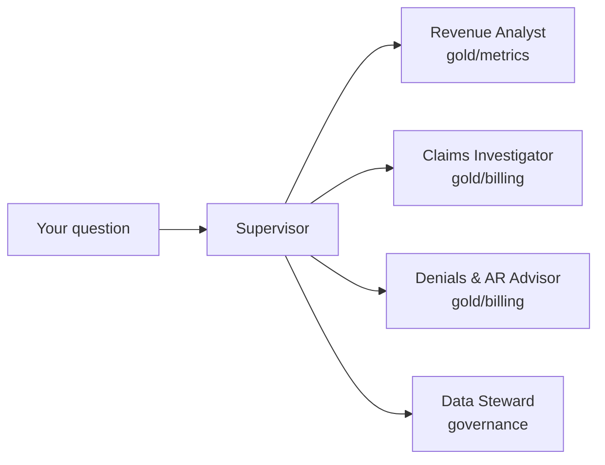

# Claimwise Agents

**Claimwise Revenue Copilot** — a multi-agent showcase built with
[Strands Agents](https://strandsagents.com), deployed on
[Amazon Bedrock AgentCore](https://aws.amazon.com/bedrock/agentcore/). One
agent per bounded context, over the
[Claimwise](https://github.com/senthilsweb/claimwise) dbt gold layer. The
[Revenue Pulse dashboard](https://github.com/senthilsweb/claimwise/tree/main/dashboards)
shows the numbers; this copilot explains them.



## I want to… → run this

```bash
git clone https://github.com/senthilsweb/claimwise-agents.git && cd claimwise-agents
cp .env.sample .env   # point DUCKDB_PATH at a built claimwise/dbt-pipeline/rcm.duckdb
```

| I want to… | Run this |
|---|---|
| Try it with zero AWS cost | `make setup && make smoke` — [Getting Started](docs/getting-started.md) |
| Chat with the full crew | `make run` — [Commands](docs/commands.md) |
| Talk to one specialist directly | `make run AGENT=investigator` (or `analyst` / `advisor` / `steward`) |
| Run the deterministic eval suite | `make eval` — 19 questions checked against live values |
| Serve it over HTTP like AgentCore Runtime would | `PORT=18080 make runtime-dev` — [Deployment](docs/deployment.md) |
| See every prompt and tool call | Set up tracing — [Observability](docs/observability.md) |
| Understand the agent design | [The Agents](docs/the-agents.md) |

## Documentation

The wiki lives in [docs/](docs/) and is published at
<https://senthilsweb.github.io/claimwise-agents/>:

- [Home](docs/index.md) — how the pieces fit
- [Getting Started](docs/getting-started.md) — two 5-minute paths in
- [Configuration](docs/configuration.md) — every environment variable
- [The Agents](docs/the-agents.md) — the bounded-context design, one agent at a time
- [Commands](docs/commands.md) — every `make` target
- [Observability](docs/observability.md) — LangSmith, Arize AX, and OpenObserve, all optional
- [Deployment](docs/deployment.md) — the AgentCore Runtime, local and (paused) cloud
- [Runbook](docs/runbook.md) — what runs automatically, what has cost or risk, real failures and fixes
- [FAQ](docs/faq.md)

## Layout

```
openspec/           specs and change proposals — the intent lives here
agents/              the Python package
  contexts/           one file per bounded-context agent, plus the Supervisor
  tools/              the tools each agent is allowed to call
  eval/               tool_smoke (no LLM) + golden/claim/routing evals
  runtime.py          the AgentCore Runtime HTTP entrypoint
  cli.py              the local chat entrypoint
docs/                the wiki (this README is only the front door)
```

Work follows AI-DLC: **Intent → Execution → Operations**. The intent for
the first release is documented in
[`openspec/changes/claimwise-revenue-copilot/`](openspec/changes/claimwise-revenue-copilot/).

## Related

- [claimwise](https://github.com/senthilsweb/claimwise) — the dbt pipeline, gold layer, and dashboard this copilot reads
- [Strands Agents](https://github.com/strands-agents/sdk-python)
