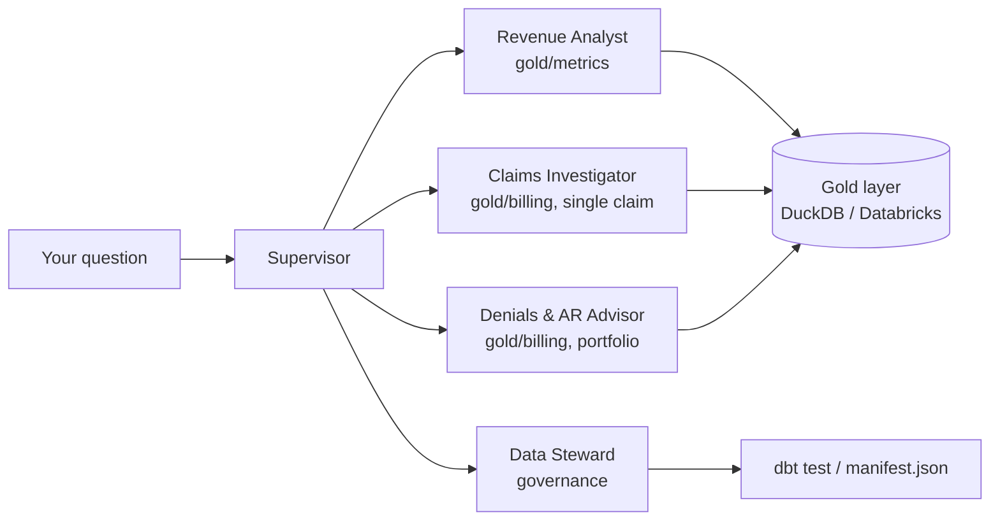
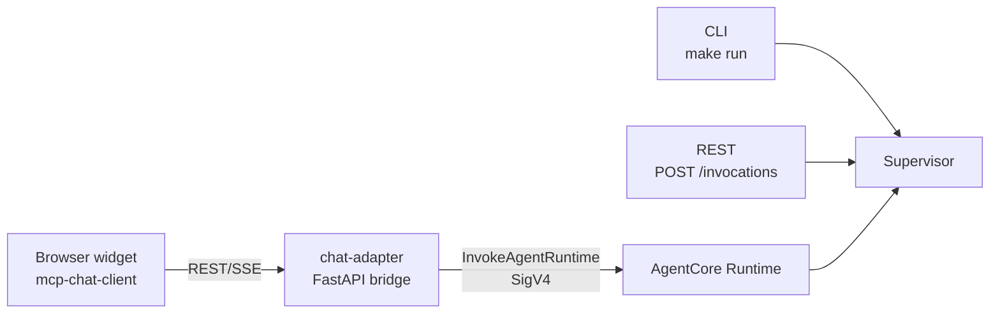
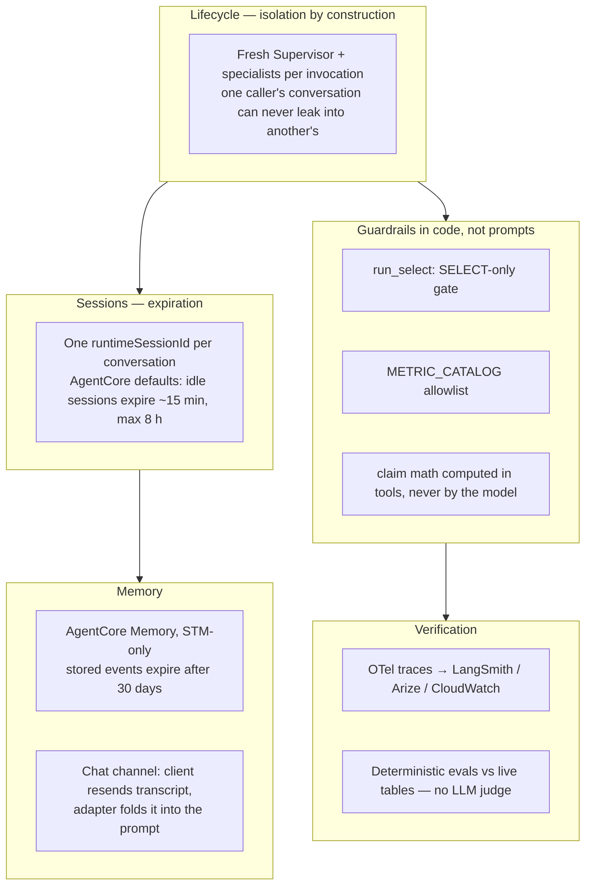

# Architecture

At the end you will know how a question actually flows through the
system, what each component is allowed to touch, and the rules that are
enforced in code rather than just in a prompt.

## High-Level Architecture



## Tech Stack

The one distinction that makes the rest of the stack make sense:
**Strands is the agent harness, AgentCore is the hosting substrate.**
Strands owns everything that happens *inside* a request — the agent
loop, tool calling, agents-as-tools routing, tracing hooks — and runs
identically on a laptop or in the cloud. AgentCore owns everything
*around* a request — the managed HTTP endpoint, session lifecycle,
Memory, observability delivery — and contains no agent logic at all.
Either side can change without touching the other; that's why `make run`
and the live deployment execute the same code.

| Layer | Technology | Role here |
|---|---|---|
| Agent harness | [Strands Agents SDK](https://strandsagents.com) | The loop: prompts, tool calling, `Agent.as_tool()` for Supervisor→specialist routing |
| Hosting | Amazon Bedrock AgentCore Runtime | Managed `/invocations` endpoint, sessions, `direct_code_deploy` (no Docker) |
| Model | Claude Sonnet 5 via Amazon Bedrock | The only model; id always from `BEDROCK_MODEL_ID`, never hardcoded |
| Memory | AgentCore Memory (STM-only) | Auto-created at deploy; session-scoped conversation events |
| Data | DuckDB (dev) / Databricks (prod) | The claimwise gold layer — the only thing tools read |
| Governance | dbt | The Data Steward shells out to `dbt test` and reads `manifest.json` lineage |
| Chat channel | [mcp-chat-client](https://github.com/senthilsweb/mcp-chat-client) + FastAPI `chat-adapter/` | Browser conversations with the deployed agent — [Chat Channel](chat-channel.md) |
| Observability | OpenTelemetry → LangSmith, Arize AX, OTLP collector; CloudWatch/X-Ray | Every prompt and tool call traced, locally and in the cloud |
| Tooling | uv, GitHub Actions, GHCR | Dependency management, docs publish, public adapter image |

### The AWS services, precisely

"Deployed on AgentCore" actually touches seven AWS services. This is
every one the live deployment uses and what it does here:

| AWS service | Used for |
|---|---|
| Amazon Bedrock | Model inference — `us.anthropic.claude-sonnet-5`, invoked by Strands through the standard credential chain |
| Bedrock AgentCore **Runtime** | The managed agent host: the `/invocations` endpoint, session lifecycle, `direct_code_deploy` packaging |
| Bedrock AgentCore **Memory** | The STM-only conversation store (`claimwise_supervisor_mem`, 30-day event expiry), auto-created and attached by the deploy |
| **IAM** | One deploy-time user (`claimwise-agents`) carrying seven AWS-managed policies, plus the Runtime's auto-created execution role (`AmazonBedrockAgentCoreSDKRuntime-…`) that the agent actually runs as |
| **S3** | The deployment artifact bucket (`bedrock-agentcore-codebuild-sources-…`) that `direct_code_deploy` zips source into — no Docker, no ECR |
| **CloudWatch** | The Runtime's log groups, plus the Logs *Delivery* pipeline (source → destination) that carries traces out to the GenAI Observability dashboard |
| **X-Ray** | The trace destination behind that dashboard — including the resource policy AWS only auto-creates when the caller holds `xray:PutResourcePolicy` |

The IAM detail deserves the callout: the deploy user's policies are
`AmazonBedrockLimitedAccess` (the original model-invoke scope),
`IAMFullAccess` (the toolkit creates the execution role for you),
`BedrockAgentCoreFullAccess`, `AmazonS3FullAccess`,
`AmazonBedrockAgentCoreMemoryBedrockModelInferenceExecutionRolePolicy`,
`CloudWatchLogsFullAccess`, and `AWSXRayFullAccess` — the last two were
discovered one failed deploy at a time, and that story (with the
why-per-policy table) lives in
[Deployment & Integration](deployment-integration.md#deployment).
Runtime credentials are separate and much narrower: the execution role
runs the agent, and the chat adapter needs exactly one permission,
`bedrock-agentcore:InvokeAgentRuntime` on the Runtime ARN.

## Entry Points

Every way a question reaches the Supervisor — same agent, different
transport:



The browser path needs the bridge because `InvokeAgentRuntime` requires
SigV4-signed requests — AWS credentials never belong in a browser. The
full client → adapter → runtime architecture (sequence diagram, contract
translation, how other channels like Teams slot in) has its own page:
[Chat Channel](chat-channel.md).

## Agent Flow

```
User question
  → Supervisor (reads the question's vocabulary, picks a specialist)
    → Specialist agent (its own system prompt, its own tools)
      → Tool call (fixed-shape SQL, or a real subprocess for the Steward)
        → Gold layer (DuckDB or Databricks) / dbt manifest
      ← structured result (rows, or a computed summary)
    ← the specialist's answer, in its own words
  ← the Supervisor's composed final answer
```

A question that needs more than one specialist (rare) has the Supervisor
call each one in turn and compose the final answer itself — it never
joins their raw data.

## Components

| Component | Bounded context | Tools |
|---|---|---|
| Revenue Analyst | `gold/metrics` | `query_metric`, `explain_metric` |
| Claims Investigator | `gold/billing`, single claim | `get_claim_story`, `list_claims` |
| Denials & AR Advisor | `gold/billing`, portfolio | `payer_scorecard`, `ar_aging`, `appeal_outcomes` |
| Data Steward | pipeline governance | `run_dq_checks`, `get_lineage`, `glossary_lookup` |
| Supervisor | context map | the four agents above, wrapped as tools |

## Tool Calling

**Read-only, by construction.** Every tool's SQL passes through one
function (`agents/data.py`'s `run_select`) that rejects anything that
isn't a plain `SELECT`/`WITH` statement before it ever reaches a
connection — tested directly (`make smoke` includes "run_select rejects a
write statement"), not just assumed from a prompt.

**Metric-first.** The Revenue Analyst's `query_metric` only accepts an
explicit allowlist of six published `mtr_*` tables — a Python `dict`, not
a suggestion. It cannot see or join raw fact tables.

**One tool per bounded context, even for the same data.** The Denials &
AR Advisor's `payer_scorecard` and the Revenue Analyst's `query_metric`
can both read `mtr_payer_scorecard`, but each agent gets its own named
tool. No agent's toolset spans another agent's vocabulary.

**A claim's story is computed in code, not by the model.**
`get_claim_story` returns a claim's activities and collections ordered by
date, with `total_collected` and `amount_outstanding` already computed —
the model narrates what the tool computed, it never sums rows itself.
This rule exists *because* an earlier version let the model do that
arithmetic, and it got the answer wrong four different ways across four
tries — see [Operations](operations.md#runbook).

## Agent-to-Agent Communication

The Supervisor holds no data tools of its own — only the four specialists
above, each wrapped via Strands'
[`Agent.as_tool()`](https://github.com/strands-agents/sdk-python). Calling
a specialist is just another tool call from the Supervisor's point of
view. Its system prompt's "context map" section names each specialist and
the vocabulary it owns — that section *is* the routing table.

## Memory

**Short-term (within one chat session):** each specialist is rebuilt
fresh on every tool call — by design, so memory never leaks into a
bounded context that shouldn't have it (see the shared-Supervisor bug in
[Operations](operations.md#runbook)).

**Multi-turn from the browser widget:** needs no Memory at all — the
widget resends its full transcript every turn and `chat-adapter` folds it
into the prompt, so context travels with each request into the
per-invocation fresh Supervisor.

**Long-term (across separate invocations):** an STM-only AgentCore
Memory resource (`claimwise_supervisor_mem`, 30-day event expiry) is
attached to the live Runtime — `agentcore deploy` created it as a side
effect. In code, `agents/runtime.py` builds an
`AgentCoreMemorySessionManager` keyed by the request's session ID, and
only when `MEMORY_ID` is set — blank means Memory stays fully out of the
path, identical to it not existing. Only the Supervisor's dialogue is
restored; the specialists always start blank. The chat channel doesn't
lean on any of this — its context travels with each request, as above.

## Harness Engineering

The deliberate engineering around the agent loop — isolation, memory,
expiration, guardrails — in one picture:



Reading it top to bottom: every invocation starts clean (Lifecycle), is
scoped to a conversation that AgentCore expires on its own schedule
(Sessions), remembers only what's deliberately carried — cloud-side STM
events with a 30-day expiry, or the chat channel's folded transcript
(Memory) — can only ever read what the code allows regardless of what
the model asks for (Guardrails), and everything it does is traced and
eval-checked against real numbers (Verification). The details behind
each box are in the sections above and in
[Chat Channel](chat-channel.md); the expiry values come from the deploy
state file — see
[`bedrock_agentcore.sample.yaml`](https://github.com/senthilsweb/claimwise-agents/blob/main/bedrock_agentcore.sample.yaml).

## Prompt Strategy

Each agent's system prompt carries exactly one bounded context's
vocabulary and rules — never another agent's. Every specialist's prompt
follows the same shape: what it is, its vocabulary, and numbered rules
(what tool to call for what kind of question, what it must never do —
recompute a rate, guess a lineage, invent a definition). The Supervisor's
prompt has no data vocabulary at all — only the context map.

## Security

- **Authentication** — to Bedrock via the standard AWS credential chain
  (`AWS_PROFILE` or explicit keys); to Databricks via a read-only
  personal access token.
- **Authorization / trust boundary** — read-only is enforced in code
  (`agents/data.py`), not granted by an IAM role alone. Even if credentials
  had write access, no code path in this repo issues a write statement.
- **Secrets** — all credentials live in `.env` (gitignored, never
  committed); `.env.sample` is the contract. See
  [Deployment & Integration](deployment-integration.md#configuration).
- **PII** — the gold layer contains patient and staff names but no
  clinical detail beyond what Claimwise's own synthetic dataset generates;
  no additional PII handling is implemented in this repo beyond what the
  read-only boundary already provides.

## What next

- Configuring credentials and calling this over REST/MCP/SDK/CLI → [Deployment & Integration](deployment-integration.md)
- Tracing, runbooks, and real failures seen so far → [Operations](operations.md)
