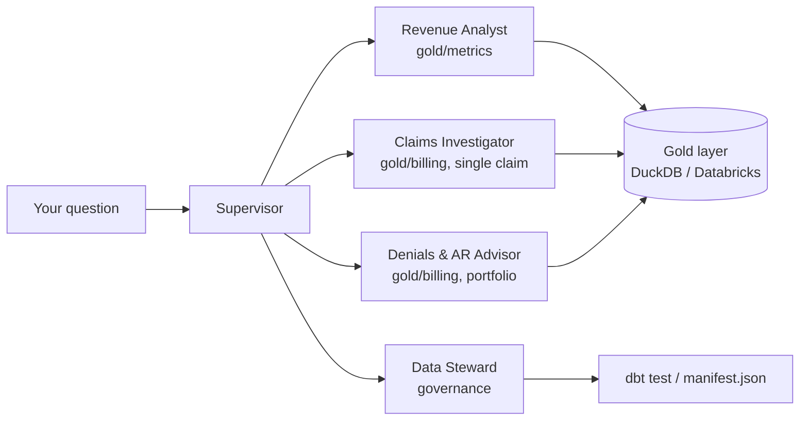

# Architecture

At the end you will know how a question actually flows through the
system, what each component is allowed to touch, and the rules that are
enforced in code rather than just in a prompt.

## High-Level Architecture



## Agent Flow

```
User question
  → Supervisor (reads the question's vocabulary, picks a specialist)
    → Specialist agent (its own system prompt, its own tools)
      → Tool call (fixed-shape SQL, or a real subprocess for the Steward)
        → Gold layer (DuckDB or Databricks) / dbt manifest
      ← structured result (rows, or a computed summary)
    ← the specialist's answer, in its own words
  ← the Supervisor's composed final answer
```

A question that needs more than one specialist (rare) has the Supervisor
call each one in turn and compose the final answer itself — it never
joins their raw data.

## Components

| Component | Bounded context | Tools |
|---|---|---|
| Revenue Analyst | `gold/metrics` | `query_metric`, `explain_metric` |
| Claims Investigator | `gold/billing`, single claim | `get_claim_story`, `list_claims` |
| Denials & AR Advisor | `gold/billing`, portfolio | `payer_scorecard`, `ar_aging`, `appeal_outcomes` |
| Data Steward | pipeline governance | `run_dq_checks`, `get_lineage`, `glossary_lookup` |
| Supervisor | context map | the four agents above, wrapped as tools |

## Tool Calling

**Read-only, by construction.** Every tool's SQL passes through one
function (`agents/data.py`'s `run_select`) that rejects anything that
isn't a plain `SELECT`/`WITH` statement before it ever reaches a
connection — tested directly (`make smoke` includes "run_select rejects a
write statement"), not just assumed from a prompt.

**Metric-first.** The Revenue Analyst's `query_metric` only accepts an
explicit allowlist of six published `mtr_*` tables — a Python `dict`, not
a suggestion. It cannot see or join raw fact tables.

**One tool per bounded context, even for the same data.** The Denials &
AR Advisor's `payer_scorecard` and the Revenue Analyst's `query_metric`
can both read `mtr_payer_scorecard`, but each agent gets its own named
tool. No agent's toolset spans another agent's vocabulary.

**A claim's story is computed in code, not by the model.**
`get_claim_story` returns a claim's activities and collections ordered by
date, with `total_collected` and `amount_outstanding` already computed —
the model narrates what the tool computed, it never sums rows itself.
This rule exists *because* an earlier version let the model do that
arithmetic, and it got the answer wrong four different ways across four
tries — see [Operations](operations.md#runbook).

## Agent-to-Agent Communication

The Supervisor holds no data tools of its own — only the four specialists
above, each wrapped via Strands'
[`Agent.as_tool()`](https://github.com/strands-agents/sdk-python). Calling
a specialist is just another tool call from the Supervisor's point of
view. Its system prompt's "context map" section names each specialist and
the vocabulary it owns — that section *is* the routing table.

## Memory

**Short-term (within one chat session):** each specialist is rebuilt
fresh on every tool call — by design, so memory never leaks into a
bounded context that shouldn't have it (see the shared-Supervisor bug in
[Operations](operations.md#runbook)).

**Long-term (across separate invocations):** code-ready, not yet live.
`agents/runtime.py` builds an `AgentCoreMemorySessionManager` keyed by the
AgentCore request's session ID, but only when `MEMORY_ID` is set — blank
by default, with identical behavior to not having Memory at all. It needs
a live AgentCore Memory resource this account can't create yet — see
[Deployment & Integration](deployment-integration.md).

## Prompt Strategy

Each agent's system prompt carries exactly one bounded context's
vocabulary and rules — never another agent's. Every specialist's prompt
follows the same shape: what it is, its vocabulary, and numbered rules
(what tool to call for what kind of question, what it must never do —
recompute a rate, guess a lineage, invent a definition). The Supervisor's
prompt has no data vocabulary at all — only the context map.

## Security

- **Authentication** — to Bedrock via the standard AWS credential chain
  (`AWS_PROFILE` or explicit keys); to Databricks via a read-only
  personal access token.
- **Authorization / trust boundary** — read-only is enforced in code
  (`agents/data.py`), not granted by an IAM role alone. Even if credentials
  had write access, no code path in this repo issues a write statement.
- **Secrets** — all credentials live in `.env` (gitignored, never
  committed); `.env.sample` is the contract. See
  [Deployment & Integration](deployment-integration.md#configuration).
- **PII** — the gold layer contains patient and staff names but no
  clinical detail beyond what Claimwise's own synthetic dataset generates;
  no additional PII handling is implemented in this repo beyond what the
  read-only boundary already provides.

## What next

- Configuring credentials and calling this over REST/MCP/SDK/CLI → [Deployment & Integration](deployment-integration.md)
- Tracing, runbooks, and real failures seen so far → [Operations](operations.md)
