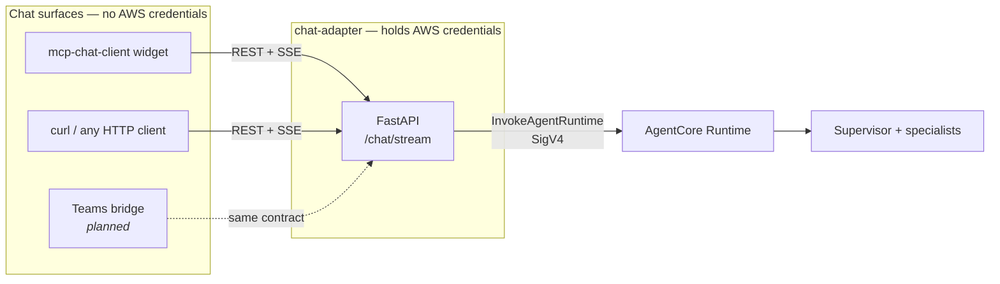
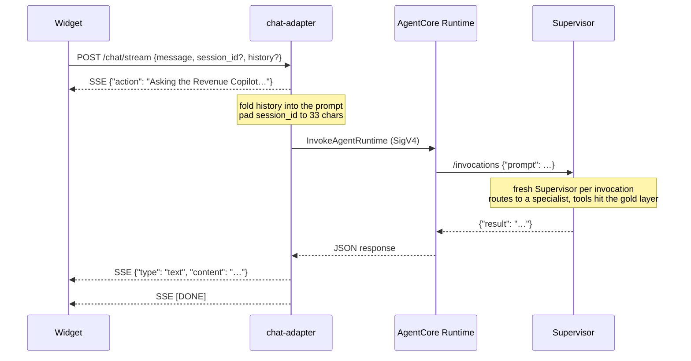

# Chat Channel

At the end you will know exactly how a browser chat message travels
through `chat-adapter/` to the live AgentCore Runtime and back, which
parts of that path are channel-agnostic, and what a new channel
(Microsoft Teams, a custom app) would actually need to add.

## Why a separate channel layer exists

The cloud Runtime only speaks `InvokeAgentRuntime` — SigV4-signed
requests with AWS credentials. No chat surface can do that directly: a
browser must never hold AWS credentials, and a chat platform like Teams
can only push events to URLs you give it. So every chat surface reaches the agent
through a credentialed bridge, and
[`chat-adapter/`](https://github.com/senthilsweb/claimwise-agents/tree/main/chat-adapter)
is that bridge — deliberately thin, with no agent logic in it.



## One turn, end to end



Real run against the live Runtime (the adapter's smoke test):

```bash
curl -N localhost:8006/chat/stream -H 'Content-Type: application/json' \
  -d '{"message": "What is our overall denial rate? One sentence."}'
```

```
data: {"action": "Asking the Revenue Copilot…"}

data: {"type": "text", "content": "Our overall denial rate is 14.62%.\n"}

data: [DONE]
```

## What the adapter translates

| Client side (widget contract) | Runtime side (AgentCore) |
|---|---|
| `POST /chat/stream` `{message, session_id?, history?}` | `InvokeAgentRuntime` with `payload={"prompt": …}` |
| `session_id` — any string, optional | sanitized and padded to the required 33-char `runtimeSessionId` |
| `history` — the client resends its transcript every turn | folded into the prompt (last 10 turns) |
| SSE `{"type":"text","content":…}` … `[DONE]` | the Runtime's JSON `{"result": …}` |
| SSE `{"action": …}` live status line | emitted once up front — a Supervisor answer can take a minute or two |

Two decisions worth understanding:

- **Multi-turn context travels with the request, not in the cloud.**
  `agents/runtime.py` builds a fresh Supervisor per invocation, and the
  adapter deliberately doesn't lean on AgentCore Memory — so it relies
  on the client resending its transcript, which the widget already does.
  Follow-ups like "how does *that* compare to the 10% benchmark?" work
  today because of this folding.
- **The read timeout is 900s, not boto3's 60s default.** The Supervisor
  fans out to specialists, and a long answer would otherwise be cut off
  mid-run.

The adapter also relays chunk-by-chunk if the Runtime entrypoint is
ever made streaming (an async-generator entrypoint returns
`text/event-stream`); today the entrypoint returns one dict, so the
answer arrives as a single SSE chunk.

## What generalizes to other channels

Everything left of `InvokeAgentRuntime` is channel-agnostic: **any
client that can POST JSON and read SSE is already a working channel** —
the widget and `curl` prove it. A new chat surface adds only a thin
translation of *its* inbound contract onto the adapter's:

| Channel | What its bridge must translate | Status |
|---|---|---|
| Browser widget | nothing — the adapter speaks its contract natively | **Live** (`make chat`) |
| Custom app / script | plain HTTP + SSE, as above | **Live** (it's just the REST contract) |
| Microsoft Teams | Teams *pushes* activities (it can't consume SSE): a small bot service receives the webhook, maps conversation + thread → `session_id`, prior replies → `history`, POSTs to `/chat/stream`, and sends the final chunk back through the Bot Framework | Planned |

The Teams bridge stays outside the adapter on purpose: the adapter
never learns channel-specific concerns (webhook signing, ack deadlines,
thread mechanics), and each channel stays a thin translation layer
instead of a fork of the invoke path. Planned work is tracked in the
[task register](https://github.com/senthilsweb/claimwise-agents/blob/main/openspec/changes/claimwise-revenue-copilot/tasks.md).

## Security

- **Trust boundary:** clients hold no AWS credentials; only the adapter
  does, and its role needs exactly one permission —
  `bedrock-agentcore:InvokeAgentRuntime` on the Runtime ARN.
- **The adapter is a test bridge as shipped:** CORS wide open, no auth.
  Before any public exposure, add an API-key header check — the widget
  passes custom headers via `config.headers`, so no widget change is
  needed.
- The agent's own guardrails (read-only by construction, metric
  allowlists) are unchanged — see [Architecture](architecture.md#security).

## What next

- Running the widget + adapter stack → [Deployment & Integration](deployment-integration.md#browser-chat-widget)
- The agent behind the Runtime → [Architecture](architecture.md)
