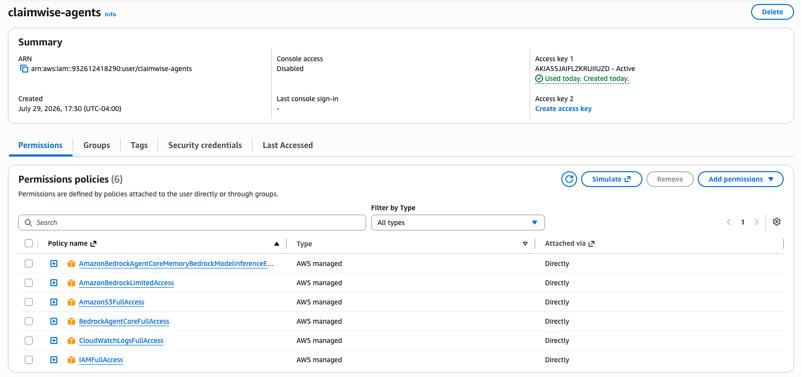
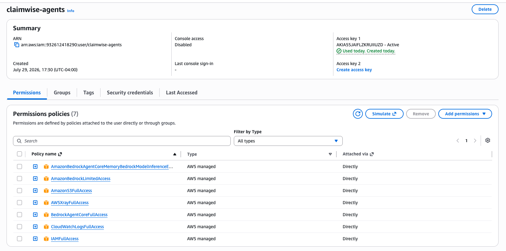

# Deployment & Integration

At the end you will know how to run the agents locally, how they're
deployed live on AWS today, and which integration method to reach for.

## Configuration

Every variable is in [Configuration](configuration.md) — the short
version: Bedrock model access, a data target (`duckdb` or `databricks`),
and a set of fully optional observability/memory variables that default
to off.

## Deployment

**Local:** `agents/runtime.py` wraps the Supervisor with
[`BedrockAgentCoreApp`](https://github.com/aws/bedrock-agentcore-sdk-python) —
the same agent used everywhere else, only the transport changes (HTTP
`/invocations` instead of a chat loop). See [Examples](examples.md#rest-api)
for a full runnable walkthrough.

**AWS AgentCore Runtime — live.** The same Runtime is deployed to Amazon
Bedrock AgentCore's managed cloud service. Deploying it needed IAM
permissions beyond this project's original Bedrock-model-invoke-only
scope — all attached directly to the `claimwise-agents` IAM user as
AWS-managed policies:

| Policy | Why |
|---|---|
| `IAMFullAccess` | The toolkit creates the Runtime's execution role on your behalf |
| `BedrockAgentCoreFullAccess` | The control plane — Runtime, Memory, Gateway |
| `AmazonS3FullAccess` | The deployment artifact bucket, for `direct_code_deploy` (no Docker) |
| `AmazonBedrockAgentCoreMemoryBedrockModelInferenceExecutionRolePolicy` | Memory's own model-inference execution role |
| `CloudWatchLogsFullAccess` | Auto-creating the Runtime/Memory log groups and the CloudWatch Logs *Delivery* pipeline (source → destination → delivery) that carries traces out |
| `AWSXRayFullAccess` | Specifically `xray:PutResourcePolicy` — without it, the delivery destination exists but AWS can't grant it permission to actually receive traces |

```bash
export AWS_PROFILE=claimwise AWS_REGION=us-east-2 AGENTCORE_SUPPRESS_RECOMMENDATION=1

agentcore configure --entrypoint agents/runtime.py --name claimwise_supervisor \
  --region us-east-2 --non-interactive

agentcore deploy --agent claimwise_supervisor --auto-update-on-conflict \
  --env "AGENT_TARGET=databricks" \
  --env "BEDROCK_MODEL_ID=us.anthropic.claude-sonnet-5" \
  --env "AWS_REGION=us-east-2" \
  --env "DATABRICKS_HOST=..." --env "DATABRICKS_HTTP_PATH=..." \
  --env "DATABRICKS_TOKEN=..." --env "DATABRICKS_CATALOG=workspace" \
  --env "LANGSMITH_TRACING=true" --env "LANGSMITH_API_KEY=..." --env "LANGSMITH_PROJECT=..." \
  --env "ARIZE_SPACE_ID=..." --env "ARIZE_API_KEY=..." --env "ARIZE_PROJECT_NAME=..." \
  --env "OTEL_EXPORTER_OTLP_ENDPOINT=..." --env "OTEL_EXPORTER_OTLP_HEADERS=..."
```

`DUCKDB_PATH` is a local file path — meaningless on the cloud runtime, so
the live deployment always targets Databricks, never DuckDB. Full
worked examples against the live endpoint (`agentcore invoke`) are in
[Examples](examples.md).

Three real problems hit during this deploy, all fixed — see
[Operations](operations.md#runbook) for the full story: a `numpy`
version pinned too new to have a published ARM64 wheel (packaging
failure), forgetting `--env` on the first deploy (the Runtime crashed on
a missing `BEDROCK_MODEL_ID`, surfaced by `agentcore invoke` as a
generic timeout — the real cause only showed up in CloudWatch logs), and
the CloudWatch/X-Ray permission gap below.

### Observability permissions, granted in two passes

The first live deploy succeeded at the Runtime/Memory level but AWS
Bedrock AgentCore's own "Enabling observability..." step failed twice,
for two genuinely different reasons — each needed its own IAM policy,
granted through the AWS Console (**IAM → Users → claimwise-agents → Add
permissions → Attach policies directly**):

**Pass 1 — `CloudWatchLogsFullAccess`.** The first deploy's own log
group creation and the CloudWatch Logs *Delivery* API (`PutDeliverySource`,
which sets up the pipeline that carries Runtime traces out) were both
denied — the user had no `logs:*` permissions at all yet.



**Pass 2 — `AWSXRayFullAccess`.** Redeploying with `CloudWatchLogsFullAccess`
attached got further — the delivery source and destination both got
created — but the deploy still failed at the last step: `AccessDeniedException:
Access Denied for this Delivery Destination`. The actual cause: AWS
auto-creates the resource policy that lets a Delivery Destination *receive*
traces only when the caller also has `xray:PutResourcePolicy` and
`xray:ListResourcePolicies` — permissions `BedrockAgentCoreFullAccess`
does not include (it only grants read-oriented X-Ray actions). Attaching
`AWSXRayFullAccess` fixed it.



Redeploying after Pass 2 logged `Observability enabled for
runtime/claimwise_supervisor-lmETE5GGLM - logs: True, traces: True` —
both the GenAI Observability Dashboard (CloudWatch/X-Ray) and this
project's own LangSmith/Arize AX/OTLP tracing (see
[Operations](operations.md#tracing)) are now live on the cloud Runtime,
not just locally.

**Docker, AWS Lambda, Kubernetes:** not part of this project's deployment
story — AgentCore Runtime is the only cloud target designed for.

## Upgrading

What to run when something changes, by what changed:

| What changed | How to upgrade |
|---|---|
| Agent code or prompts | Re-run the full `agentcore deploy` command above — it updates in place, same ARN, no client changes. Pass the **complete `--env` set every time**: env vars do not persist between deploys (forgetting them is exactly the crash in the Runbook). |
| Model | Change `--env BEDROCK_MODEL_ID=...` and redeploy. Nothing else references the model id. |
| Python dependencies | `uv sync` locally, run `make smoke && make eval`, then redeploy. Mind the `numpy<2.5` pin — AgentCore's arm64 cross-compile refuses to build from source (Runbook). |
| chat-adapter | Push to `main` touching `chat-adapter/**` — CI publishes the new image. Then `docker compose pull && docker compose up -d` wherever the stack runs. |
| Chat widget | Bump the pinned `sha-*` tag on the `chat-client` image in `docker-compose.yml`. |

Verify any agent redeploy the same way every time: `agentcore status`,
one `agentcore invoke` smoke question, and — if it fails — CloudWatch
logs first, because `agentcore invoke` reports startup crashes as
generic timeouts ([Operations](operations.md#runbook)).

Each successful deploy rewrites the gitignored `.bedrock_agentcore.yaml`
with the account-specific state (ARNs, memory id, session id) —
[`bedrock_agentcore.sample.yaml`](https://github.com/senthilsweb/claimwise-agents/blob/main/bedrock_agentcore.sample.yaml)
shows its shape without the real values.

## Integration Methods

Which method to reach for — every one has a full runnable example in
[Examples](examples.md):

| Method | When to use it |
|---|---|
| CLI (`make run`) | Interactive local testing, one specialist or the full crew |
| REST (`/invocations`) | Calling from anything that speaks HTTP, or once deployed to AgentCore Runtime |
| Browser chat widget (`make chat`) | Conversing with the **deployed** agent from a web UI — see below and [Chat Channel](chat-channel.md) |
| Python SDK | Embedding an agent directly in another Python process |
| MCP | **Not built yet** — needs a Lambda-packaging step first, see below |
| Event Driven (SQS/SNS/EventBridge/Kafka) | Not applicable — this project has no queue or event-bus trigger |
| Agent-to-Agent | Already how the Supervisor calls its four specialists internally — see [Architecture](architecture.md#agent-to-agent-communication) |

### Browser chat widget

A browser can't call the cloud Runtime directly — `InvokeAgentRuntime`
needs SigV4-signed requests, and AWS credentials never belong in a
browser. [`chat-adapter/`](https://github.com/senthilsweb/claimwise-agents/tree/main/chat-adapter)
is a small FastAPI bridge that translates the
[mcp-chat-client](https://github.com/senthilsweb/mcp-chat-client)
widget's REST/SSE contract into signed `InvokeAgentRuntime` calls, and
the root `docker-compose.yml` runs both for testing:

```bash
# needs AGENT_RUNTIME_ARN in .env (the agent_arn from .bedrock_agentcore.yaml)
make chat        # = docker compose up (both images pulled from GHCR)
open http://localhost:3000
```

Multi-turn works because the widget resends its transcript every turn
and the adapter folds it into the prompt — no AgentCore Memory needed.
Details in [chat-adapter/README.md](https://github.com/senthilsweb/claimwise-agents/blob/main/chat-adapter/README.md).

The adapter is also published as a public multi-arch image by
[`publish-chat-adapter.yml`](https://github.com/senthilsweb/claimwise-agents/blob/main/.github/workflows/publish-chat-adapter.yml)
on every push to `main` that touches `chat-adapter/`, so it runs anywhere
without a checkout:

```bash
docker run --rm -p 8006:8006 \
  -e AGENT_RUNTIME_ARN=arn:aws:bedrock-agentcore:us-east-2:...:runtime/claimwise_supervisor-... \
  -e AWS_REGION=us-east-2 \
  -v ~/.aws:/root/.aws:ro \
  ghcr.io/senthilsweb/claimwise-chat-adapter:latest
```

### MCP

Exposing the tools (`query_metric`, `get_claim_story`, etc.) as MCP
Gateway targets needs a Lambda-packaging step first — MCP Gateway targets
are `lambda | openApiSchema | mcpServer | smithyModel`, not a bare Python
function. Concrete next commands (once IAM allows it) are recorded in
[tasks.md](https://github.com/senthilsweb/claimwise-agents/blob/main/openspec/changes/claimwise-revenue-copilot/tasks.md),
Bolt 4.2.

## What next

- Every runnable example, with real output → [Examples](examples.md)
- Tracing every call you make → [Operations](operations.md)
