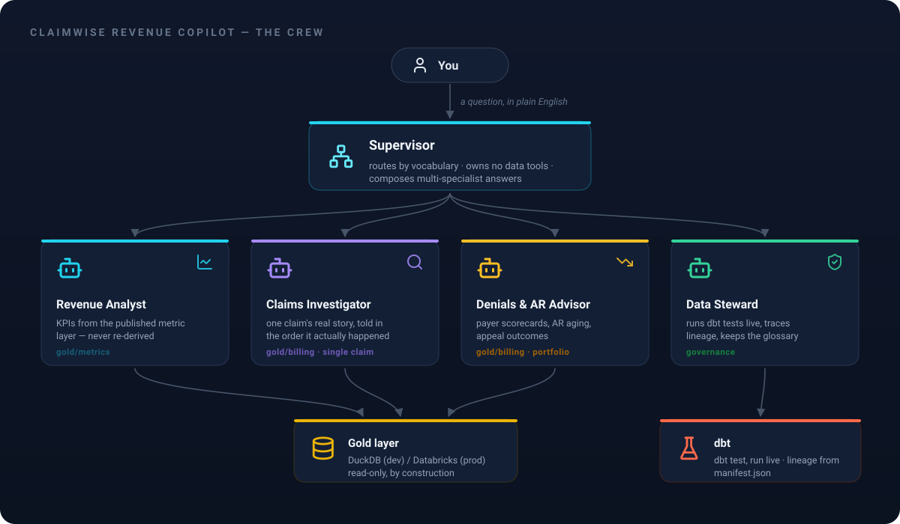

# Overview

## The use case

Claimwise is a healthcare revenue cycle management company — a synthetic
one, but built to feel real. The [claimwise](https://github.com/senthilsweb/claimwise)
repo generates its entire book of business — 5,000 claims across 8,000
encounters, spread over 24 months — and deliberately avoids uniform
randomness, because a flat distribution never looks like a real billing
shop:

- **Claim statuses settle the way a real book settles** — about 61%
  approved, 14.6% denied, and a mid-cycle tail still in review or
  freshly submitted, because a claim filed last week simply hasn't had
  time to resolve.
- **Collections follow recovery reality** — an approved claim usually
  pays near its billed amount, with a tail of partial recoveries.
- **A dbt pipeline refines all of it** through bronze, silver, and gold,
  ending in a published metric layer where every KPI is defined exactly
  once.

That gold layer already tells a story: $12.6M billed, $6.05M collected,
$4.7M still sitting in open AR, a 14.62% denial rate. The
[Revenue Pulse dashboard](https://github.com/senthilsweb/claimwise/tree/main/dashboards)
shows those numbers. What it can't do is answer the question that
follows every dashboard glance: *why?*

That's this project. **Claimwise Revenue Copilot** puts a team of agents
on top of the gold layer so a billing manager can just ask:

- *"What's our overall denial rate?"* — the **Revenue Analyst** reads it
  from the published metric layer, never recomputing a KPI on the fly.
- *"Why is claim CLM48516149 still unpaid?"* — the **Claims
  Investigator** narrates that one claim's real history, in the order it
  happened.
- *"Which payer is hurting us? Are appeals worth it?"* — the **Denials &
  AR Advisor** works the portfolio: payer scorecards, AR aging, appeal
  outcomes.
- *"Can I trust today's numbers?"* — the **Data Steward** actually runs
  the pipeline's dbt tests and traces lineage; it never offers an
  opinion it didn't verify.

A **Supervisor** routes each question to whichever specialist owns its
vocabulary — one agent per bounded context, which is the design idea the
whole project exists to demonstrate: Claimwise's gold layer is already
organized as DDD bounded contexts (`billing`, `clinical`, `admin`,
`metrics`), so the agent team mirrors the data's own boundaries instead
of piling every tool into one agent.

And you can reach the copilot however suits you: from a **browser chat
widget** talking to the live deployment ([Chat Channel](chat-channel.md)),
over the **REST API** ([Examples](examples.md)), or from the **CLI**
(`make run`). **MCP** and **Microsoft Teams** are planned as the next
channels — tracked in the
[task register](https://github.com/senthilsweb/claimwise-agents/blob/main/openspec/changes/claimwise-revenue-copilot/tasks.md),
like all in-flight work.

## Agentic AI Analytics, through metadata engineering

Strip the framing away and every answer above is the same move: natural
language in, governed SQL out. That is the real subject of this project
— **Agentic AI Analytics, made trustworthy by metadata engineering**.
The agents never guess at a schema; they operate on metadata that was
engineered first:

- the published `mtr_*` **metric layer**, where every KPI is defined
  once in dbt — agents read it, they never re-derive a number;
- a shared **business glossary** — one definition per term, a lookup
  table instead of prose repeated across prompts;
- **allowlisted tables and fixed-shape queries**, so the SQL an agent
  can produce is bounded by design, not by hope;
- dbt's own **manifest and tests**, which the Data Steward reads live
  for lineage and data-quality answers.

The metadata does the governing; the agents do the conversing.
Text-to-SQL without that layer is a demo — with it, it's analytics you
can hand to a billing manager.

## Prerequisite: the Claimwise pipeline

This repo is the conversational surface only — the data lives in the
[claimwise](https://github.com/senthilsweb/claimwise) monorepo, and the
agents can't answer anything until its pipeline has run. Before starting
here, clone claimwise, generate the synthetic seeds, and run dbt so the
gold layer is built and populated (`make setup deps build` there
produces `dbt-pipeline/rcm.duckdb`; point this repo's `DUCKDB_PATH` at
it). [Getting Started](getting-started.md) walks through both repos in
order.

## Capabilities

- Answers KPI, single-claim, and portfolio-level billing questions from
  real gold-layer data — every number traceable to the table it came from.
- Routes a question to the right specialist automatically, and composes
  an answer when a question needs more than one.
- Runs identically against DuckDB (local, zero infra) or Databricks
  (production warehouse) — same tools, same SQL, same rules.
- Exports full traces (every prompt, every tool call, every response) to
  any combination of LangSmith, Arize AX, and a generic OTLP collector.
- Deployed live on Amazon Bedrock AgentCore's managed cloud runtime,
  answering real questions against the Databricks warehouse — see
  [Deployment & Integration](deployment-integration.md).

## Limitations

- **Read-only.** No agent can write to the warehouse — there is no code
  path for it, not just a prompt instruction. See [Architecture](architecture.md).
- **Synthetic data.** The numbers are realistic by design, but they
  describe a generated company — this is a showcase, not a production
  billing system.
- Early evals were run against `amazon.nova-lite-v1:0` while Claude
  Sonnet 5 access was blocked by an unrelated AWS billing issue (since
  resolved — the live deployment runs Sonnet 5) — see
  [Reference](reference.md#faq) for why that doesn't invalidate the
  results.

## Bounded Context

| | |
|---|---|
| **Responsibilities** | Answer billing/KPI/claim questions in plain English, read-only, from the Claimwise gold layer |
| **Upstream systems** | The Claimwise dbt pipeline (bronze → silver → gold), and its published `mtr_*` metric layer |
| **Downstream systems** | None — this is a conversational surface, not a feed into another system |
| **Collaborating agents** | Internally: Revenue Analyst, Claims Investigator, Denials & AR Advisor, Data Steward, coordinated by one Supervisor |
| **External services** | Amazon Bedrock (models); optionally LangSmith, Arize AX, or any OTLP collector for tracing |

## What next

- Run it yourself, free, in a few minutes → [Getting Started](getting-started.md)
- How the five agents actually work → [Architecture](architecture.md)
