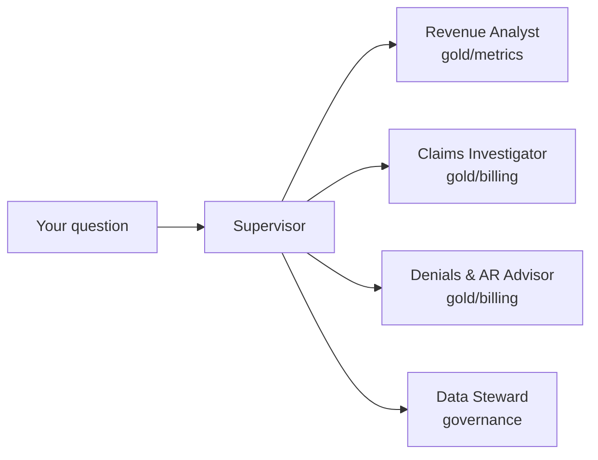

# Claimwise Agents

**Claimwise Revenue Copilot** is a multi-agent showcase built with the
[Strands Agents](https://strandsagents.com) SDK and deployed on
[Amazon Bedrock AgentCore](https://aws.amazon.com/bedrock/agentcore/). It
reads the gold layer of [Claimwise](https://github.com/senthilsweb/claimwise),
a healthcare billing (revenue cycle management) dbt pipeline, and answers
business questions in plain English.

Claimwise's gold layer is already organized as **bounded contexts** —
`clinical`, `billing`, `admin` — with a metric layer where every KPI is
defined once. This project turns that design into running code: **one
agent per bounded context**, plus a Supervisor that routes each question
to the specialist who owns it and composes the answer.



## I want to… → run this

| I want to… | Run this |
|---|---|
| Try it with zero AWS cost | `make smoke` — see [Getting Started](getting-started.md) |
| Chat with the full crew | `make run` — see [Commands](commands.md) |
| See every prompt and tool call | Set up tracing — see [Observability](observability.md) |
| Understand the agent design | [The Agents](the-agents.md) |
| Run it as an HTTP service | [Deployment](deployment.md) |
| Fix something that broke | [Runbook](runbook.md) |

## Documentation

- [Getting Started](getting-started.md) — clone it, run it, in under 5 minutes
- [Configuration](configuration.md) — every environment variable
- [The Agents](the-agents.md) — the bounded-context design, one agent at a time
- [Commands](commands.md) — every `make` target
- [Observability](observability.md) — LangSmith, Arize AX, and OpenObserve, all optional
- [Deployment](deployment.md) — the AgentCore Runtime, local and (paused) cloud
- [Runbook](runbook.md) — what runs automatically, what has cost or risk, and failures seen so far
- [FAQ](faq.md)

## Layout

```
openspec/           specs and change proposals — the intent lives here
agents/              the Python package
  contexts/           one file per bounded-context agent, plus the Supervisor
  tools/              the tools each agent is allowed to call
  eval/               tool_smoke (no LLM) + golden/claim/routing evals
  runtime.py          the AgentCore Runtime HTTP entrypoint
  cli.py              the local chat entrypoint
docs/                this site
```
